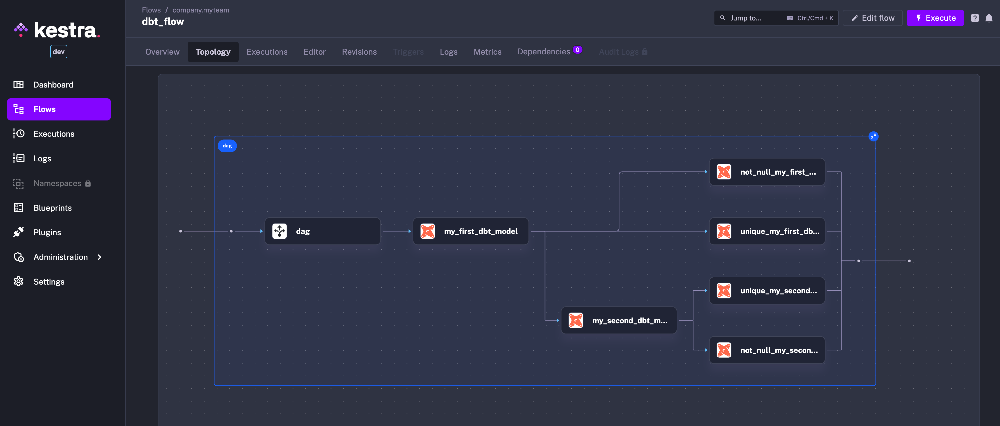

## Orchestrate dbt with kestra
A lightweight sample dbt project building dbt models in the same Postgres database used as Kestra backend.

## Getting started

To spin up Kestra in Docker (including Postgres database), use the following commands:

```bash
docker-compose up -d
sleep 60 # wait a minute for the containers to start
curl -X POST http://localhost:8080/api/v1/flows/import -F fileUpload=@kestra/git_sync.yaml
curl -X POST http://localhost:8080/api/v1/flows/import -F fileUpload=@kestra/generate_dbt_flow.yaml
curl -X POST http://localhost:8080/api/v1/executions/company.myteam/git_sync?wait=true
curl -X POST http://localhost:8080/api/v1/executions/company.myteam/generate_dbt_flow?wait=true
curl -X POST http://localhost:8080/api/v1/executions/company.myteam/dbt_flow?wait=true
```

The `curl` commands will deploy and run flows that:
- sync dbt code from this GitHub repository to Kestra 
- dynamically generate Kestra tasks based on dbt models and tests



## Limitations

Kestra runs tasks in a stateless manner. Your dbt models and tests executed with the approach presented here cannot share a working directory. Therefore:
1. You cannot use the DuckDB adapter (unless you use MotherDuck). For local DuckDB, try [this blueprint](https://kestra.io/blueprints/git/50-git-workflow-for-dbt-with-duckdb) instead.
2. If you use some dbt packackages, you need to either use the `Process` task runner or add `dbt deps` before each dbt command.

